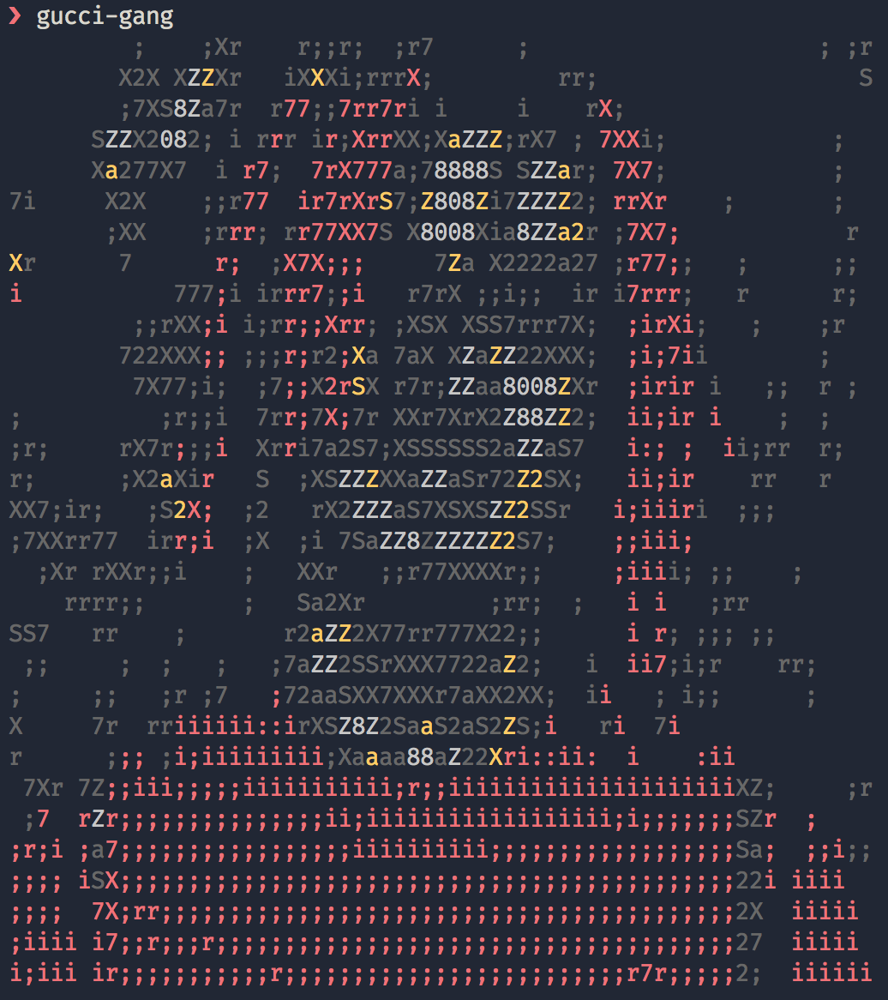

# gucci-gang

> Gucci gang, Gucci gang, Gucci gang, Gucci gang, Gucci gang, Gucci gang, Gucci gang

[](https://npm.im/gucci-gang)
[](https://travis-ci.org/macklinu/gucci-gang)
[](https://github.com/macklinu/gucci-gang/blob/master/LICENSE)
[](https://github.com/prettier/prettier)
[](https://github.com/semantic-release/semantic-release)

## Installation

```
npm install gucci-gang
```

<small>Not sure why you would ever install this though.</small>

## Usage

The simplest way to use this package is to use the CLI:

```sh
$ npx gucci-gang
```

This will print an ASCII art picture of [Lil Pump](https://twitter.com/lilpump) to your terminal, like so:



You can alternatively use the programmatic API:

```js
import gucciGang from 'gucci-gang'

gucciGang()
  .then(text => console.log(text))
  .catch(err => console.error(err))
```
